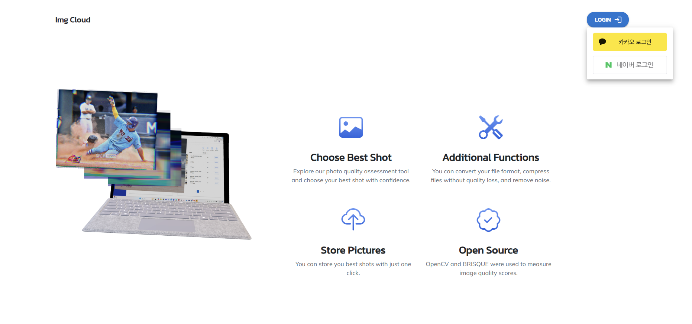
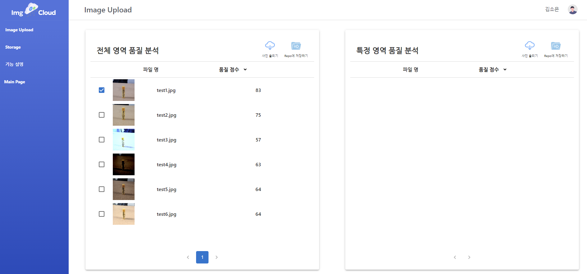
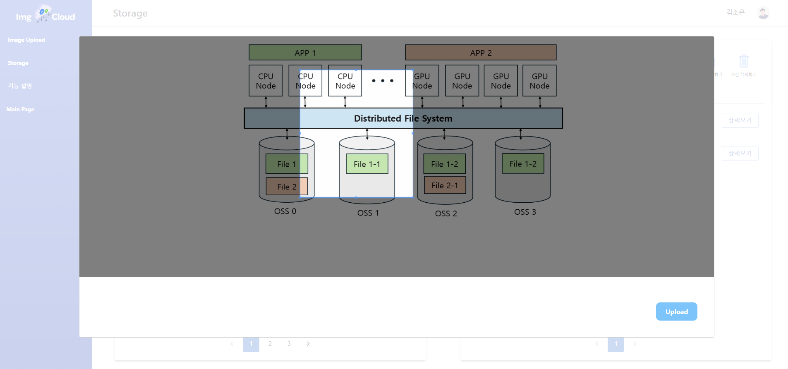
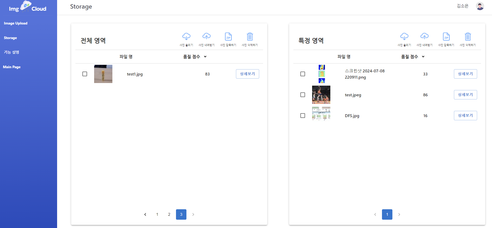
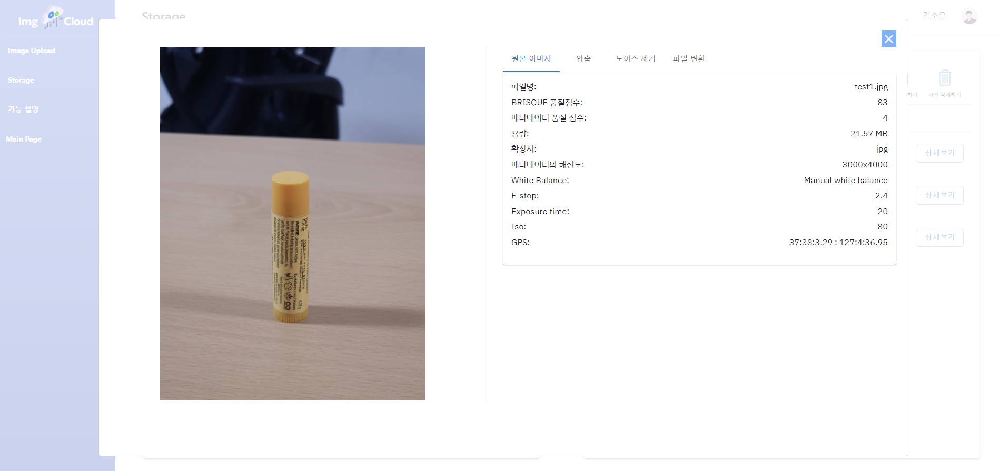
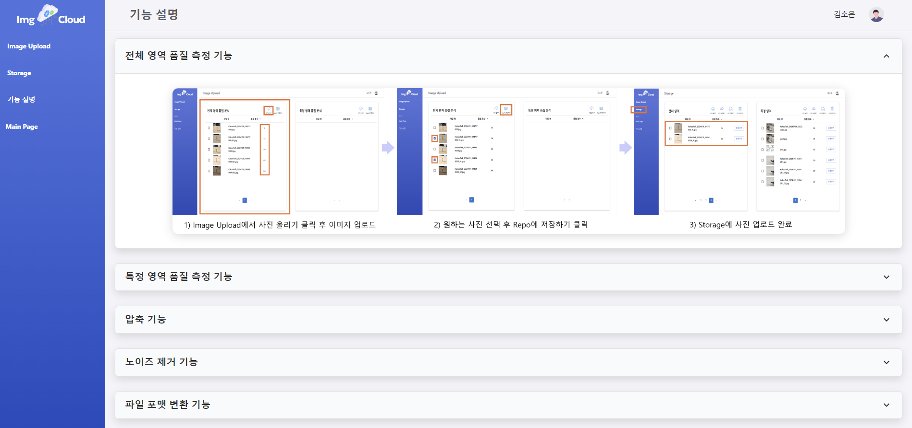
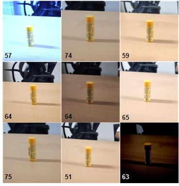

# **이미지 품질 측정 웹사이트**  
---
## 🌟 **웹사이트 소개**  
이 웹사이트는 **BRISQUE 알고리즘**을 활용하여 이미지 품질을 분석하고, 다양한 이미지 편집 및 정보 제공 기능을 지원합니다.

---

## 📄 **페이지 설명**

<details>
  <summary>🌟 메인 페이지와 이미지 업로드 페이지</summary>
  <table align="center">
    <tr>
      <td align="center">
        
        <br/><b>메인 페이지</b>
      </td>
      <td align="center">
        
        <br/><b>이미지 업로드 페이지</b>
      </td>
    </tr>
  </table>
</details>

<details>
  <summary>✂️ 이미지 크롭 페이지와 스토리지 페이지</summary>
  <table align="center">
    <tr>
      <td align="center">
        
        <br/><b>이미지 크롭 페이지</b>
      </td>
      <td align="center">
        
        <br/><b>스토리지 페이지</b>
      </td>
    </tr>
  </table>
</details>

<details>
  <summary>🔍 상세 페이지와 기능 설명 페이지</summary>
  <table align="center">
    <tr>
      <td align="center">
        
        <br/><b>상세 페이지</b>
      </td>
      <td align="center">
        
        <br/><b>기능 사용법 설명 페이지</b>
      </td>
    </tr>
  </table>
</details>


---

## 🛠️ **지원 기능**

### 1️⃣ 이미지 품질 측정
- 전체 이미지에 대한 품질 분석
- 선택한 특정 영역에 대한 품질 분석

### 2️⃣ 이미지 메타데이터 제공
- ISO, White Balance, F-stop, GPS 등 메타데이터 제공

### 3️⃣ 이미지 편집 기능
- 이미지 압축 및 파일 포맷 변경
- 해상도 측정 및 노이즈 제거

### 4️⃣ 로컬로 이미지 다운로드
- 다운로드 시 압축하여 다운 가능

   
---

## ✨ **점수 측정 예시**

<details>
  <summary>🖼️ 이미지 보기</summary>
  <div align="center">
    
  </div>
</details>

<details>
  <summary>📝 설명 보기</summary>
  <div style="font-size: 16px; line-height: 1.6; padding: 10px;">
    <p>
      위 이미지는 <b>imgCloud</b>를 이용하여 측정한 품질 점수를 보여주고 있습니다.  
      <b>BRISQUE 알고리즘</b>을 사용하여 인간의 눈으로 보기에 가장 잘 나왔다고 판단되는 사진에 높은 점수를 부여합니다.
    </p>
  </div>
</details>

---

## ⚙️ **환경 설정**  

### 📌 **프론트엔드 (Frontend) 환경 설정**  
- **React.js** 사용  
- `package.json`을 사용하여 패키지를 설치해야 합니다.
  
  ```bash
  npm install
  ```

### 📌 **백엔드 (Backend) 환경 설정**  
- **Spring Boot** 사용
- build.gradle 실행
- 아래의 **`application.properties`** 파일 설정 필요  ➡️ 위치: `backend > src > main > resources > application.properties`  
- <details>
  <summary>💾 application.properties</summary>
  
      # MySQL 데이터베이스 연결
      spring.application.name=<YOUR_DB_SCHEME>
      spring.datasource.url=jdbc:mysql://<YOUR_DB_HOST>:3306/<YOUR_DB_NAME>
      spring.datasource.username=<YOUR_DB_USER>
      spring.datasource.password=<YOUR_DB_PASSWORD>
      spring.jpa.hibernate.ddl-auto=update
      spring.jpa.show-sql=true
      Spring.jpa.hibernate.format.sql=true
      spring.jpa.properties.hibernate.dialect=org.hibernate.dialect.MySQLDialect
      logging.level.org.hibernate.orm.jdbc.bind=TRACE
      logging.level.org.springframework=INFO
      
      # AWS S3 연결
      cloud.aws.credentials.access-key=<YOUR_AWS_ACCESS_KEY>
      cloud.aws.credentials.secret-key=<YOUR_AWS_SECRET_KEY>
      cloud.aws.region.static=ap-northeast-2
      cloud.aws.stack.auto=false
      
      #security oauth -> kakao
      oauth.kakao.client-id=<YOUR_KAKAO_CLIENT_ID>
      oauth.kakao.client-secret=<YOUR_KAKAO_CLIENT_SECRET>
      oauth.kakao.redirect-uri=http://localhost:3000/oauth/redirected/kakao
      oauth.kakao.authorization-grant-type=authorization_code
      oauth.kakao.scope=profile_nickname,profile_image,account_email
      oauth.kakao.client-name=kakao
      oauth.kakao.client-authentication-method=POST
      
      #security oauth -> naver
      oauth.naver.client-id=<YOUR_NAVER_CLIENT_ID>
      oauth.naver.client-secret=<YOUR_NAVER_CLIENT_SECRET>
      oauth.naver.redirect-uri=http://localhost:3000/oauth/redirected/naver
      oauth.naver.scope=nickname,profile_image,email
      oauth.naver.authorization-grant-type=authorization_code
      oauth.naver.client-name=naver
      oauth.naver.state=<YOUR_NAVER_STATE>
      
      #bean
      spring.main.allow-bean-definition-overriding=true
      
      #file size
      spring.servlet.multipart.max-file-size=10MB
      spring.servlet.multipart.max-request-size=100MB
      spring.servlet.multipart.enabled=true
      
  </details>
  

### 📌 **기타 환경 설정**

<details>
  <summary>AWS S3 Bucket 설정</b></summary>

1. AWS 계정을 생성한 후, S3 버킷을 만드세요.  
2. 버킷 이름은 기본적으로 `imgcloud-iise`를 사용을 권장하며, 다른 이름으로 생성 시 코드 수정 필요합니다.  
3. 버킷 안에 **`person`** 및 **`thing`** 폴더를 생성하세요.

</details>

<details>
  <summary>AWS 권한 설정</b></summary>

1. IAM User 생성하여 `aws.access.key`, `aws.secret.key`를 저장합니다.  
    - ⚠️ **주의**: Secret Key는 페이지를 벗어나면 다시 확인이 불가능하므로 꼭 저장해두세요!
2. S3에 대한 권한을 부여합니다.
    - 본인의 보안 유지 필요성에 따라 다르게 설정합니다.  
    - 로컬에서 테스트용이라면 **Full Access** 및 외부 접근 허용을 설정하세요.

</details>

<details>
  <summary>OAuth를 위한 Naver, Kakao 인증 설정</b></summary>

1. [카카오 개발자 페이지](https://developers.kakao.com/)에서 Kakao 인증 설정이 가능합니다.  
2. [네이버 개발자 페이지](https://developers.naver.com/main/)에서 Naver 인증 설정이 가능합니다.

</details>

---

## ▶️ **실행 방법**  
### **프론트엔드 실행**  
```bash
npm run start
```

### **백엔드 실행**  
`ImgcloudApplication.java` 파일을 실행합니다.  

---

## 📂 **활용한 오픈 소스, 라이브러리 및 기술 스택**  

### 🖥️ **Frontend**

| 라이브러리 및 프레임워크             | 설명                                                                                       |
|-------------------------------|--------------------------------------------------------------------------------------------|
| **React.js**                  | UI 컴포넌트를 효율적으로 구성하기 위한 프레임워크(https://github.com/reactjs)                                       |
| **browser-image-compression** | 브라우저 환경에서 이미지 압축을 수행하기 위한 라이브러리                                     |
| **react-image-crop** & **react-cropper** | React에서 이미지 크롭 및 편집을 지원하는 라이브러리                                       |


### 🛠️ **Backend**

| 라이브러리 및 프레임워크                   | 설명                                                                                       |
|--------------------------------------|--------------------------------------------------------------------------------------------|
| **Spring Boot**             | RESTful API와 서버 관리에 사용되는 Java 기반 프레임워크(https://github.com/spring-projects/spring-boot)                  |
| **MySQL**                   | 데이터베이스 관리 및 저장소(https://github.com/mysql)                                                                 |
| **Apache Commons Math**     | 수학 계산 및 통계 라이브러리                                                               |
| **Lombok**                  | 코드를 간결하게 작성하기 위한 Java 라이브러리                                               |
| **Javacv-Platform**         | OpenCV와 연동되는 Java 래퍼 라이브러리                                                     |

### 📁 **추가적인 주요 라이브러리**

| 라이브러리               | 설명                                                                                       |
|-------------------------|--------------------------------------------------------------------------------------------|
| **Retrofit**            | HTTP 통신을 간편하게 처리할 수 있는 라이브러리                                              |
| **Gson**                | JSON 데이터 직렬화/역직렬화를 지원하는 라이브러리                                           |
| **OkHttp**              | HTTP 요청 및 응답을 처리하기 위한 라이브러리                                                |
| **Iamport Rest Client** | 결제 처리를 위한 라이브러리                                                                 |
| **JSZip**               | ZIP 파일 생성 및 압축 해제 기능 제공(https://github.com/Stuk/jszip)                           |
| **FileSaver.js**        | 파일 다운로드를 지원하는 브라우저 라이브러리                                                |


---

### 🔍 **OpenCV (Open Source Computer Vision Library)**  
- https://github.com/opencv/opencv
- OpenCV는 컴퓨터 비전과 이미지 처리 기능을 제공하는 오픈 소스 라이브러리입니다.
- 이미지 품질 분석, 얼굴 인식, 객체 추적 등 다양한 기능을 지원하며, **BRISQUE 알고리즘**을 통해 이미지 품질 평가를 수행합니다.
- Spring Boot와 OpenCV를 연동하여 강력한 이미지 프로세싱 기능을 구현합니다.
- **backend** > **src** > **imgcloud** > **controller** > **BrisqueController 에서 활용하고 있습니다!!**

---

### ☁️ **AWS SDK**
- https://github.com/aws/aws-sdk-java
- AWS SDK는 S3와 같은 AWS 서비스와 애플리케이션을 손쉽게 통합할 수 있는 라이브러리입니다.  
- S3 버킷을 활용해 파일 업로드 및 다운로드 기능을 구현하며, 대규모 데이터 처리에 적합합니다.  
- Spring Boot와 함께 사용하여 간편한 클라우드 파일 스토리지 기능을 제공합니다.

---

### 🎨 **Bootstrap**
- https://github.com/twbs/bootstrap
- Bootstrap은 반응형 웹 디자인과 CSS 스타일링을 지원하는 인기 있는 프론트엔드 프레임워크입니다.  
- 다양한 컴포넌트(버튼, 폼, 카드 등)와 그리드 시스템을 제공하여, 빠르고 일관된 디자인을 구현할 수 있습니다.  
- CSS와 JavaScript의 강력한 통합으로 모바일 친화적인 UI를 손쉽게 만들 수 있습니다.

---

### 🎨 **Flaticon**
- https://github.com/freepik-company/flaticon-uicons
- Flaticon은 수천 개의 고품질 아이콘 리소스를 제공하는 플랫폼입니다.  
- 웹 또는 모바일 애플리케이션의 디자인에 필요한 다양한 아이콘을 다운로드하여 사용할 수 있습니다.  
- React와 통합하여 커스터마이징 가능한 SVG 및 PNG 포맷 아이콘을 제공합니다.

---

## 📜 License
This project is licensed under the [MIT License](LICENSE).

---

